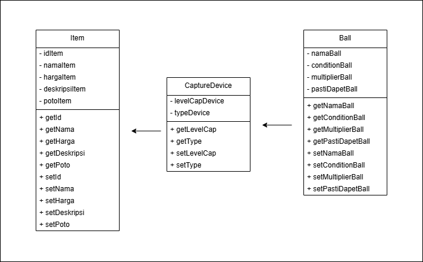
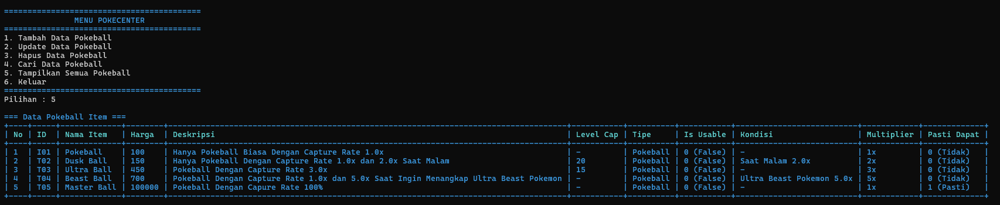
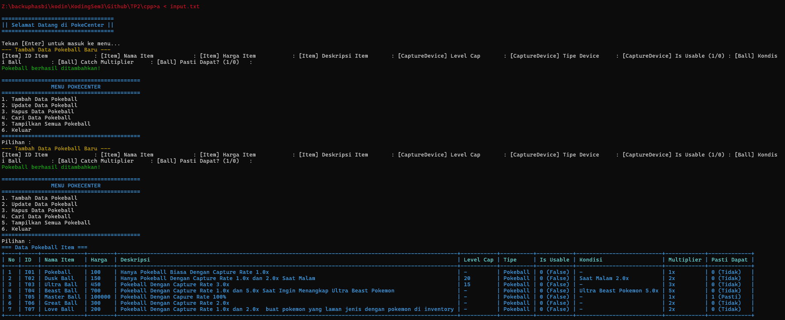
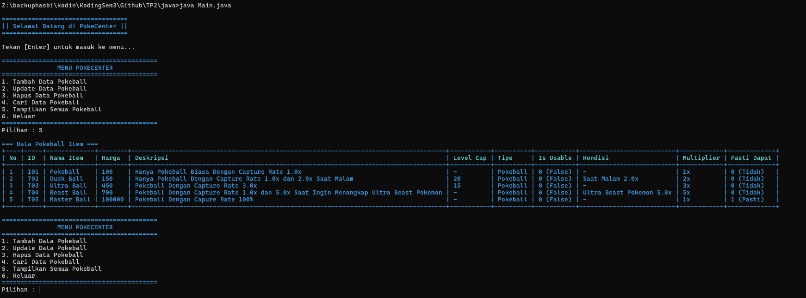
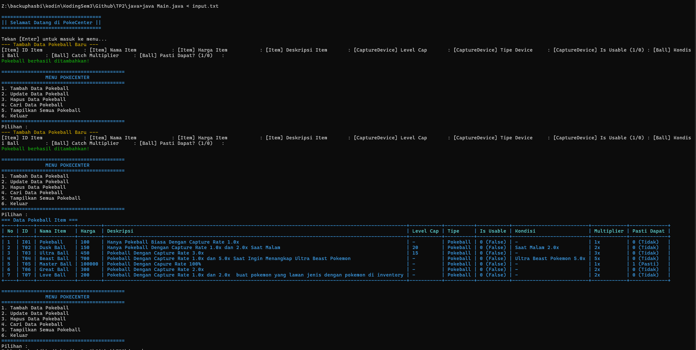
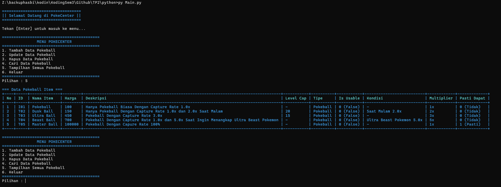
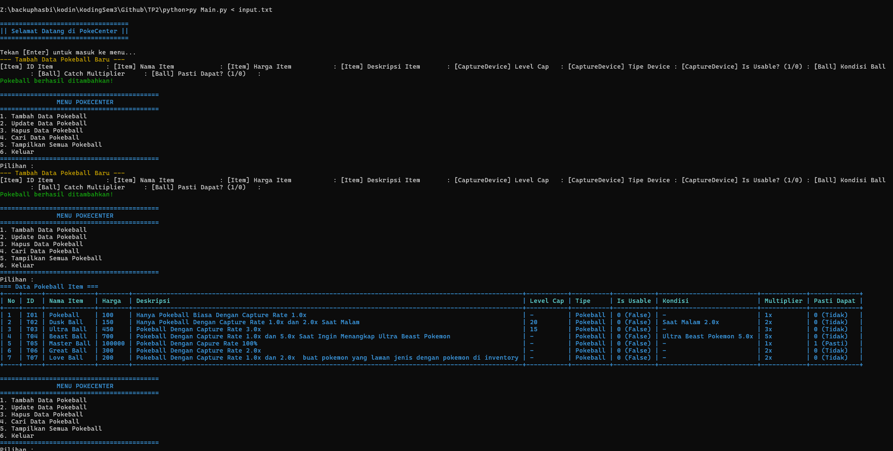
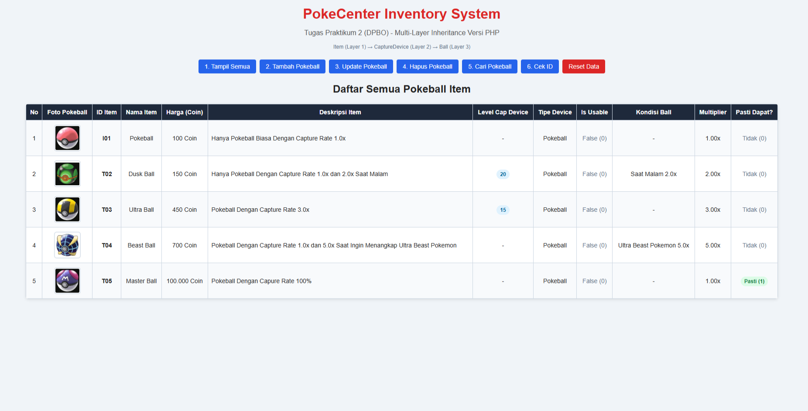
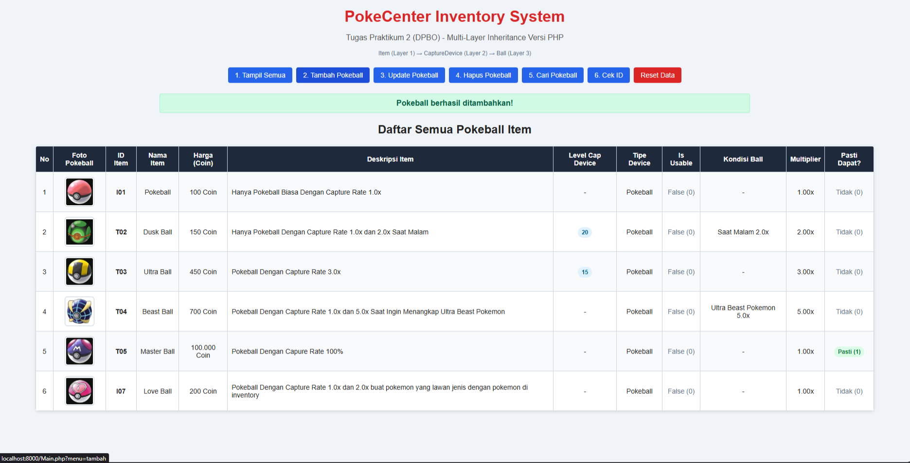

# TP2 DPBO

# Janji
Saya <strong>Muhamad Hasbie Assyattar</strong> dengan <strong>NIM 2508288</strong> mengerjakan Tugas Praktikum 2 dalam mata kuliah Desain dan Pemrograman Berorientasi Objek untuk keberkahanNya maka saya tidak melakukan kecurangan seperti yang telah dispesifikasikan. Aamiin.

# Desain


# Struktur File
 ```
Main
├── CPP/
│   └── Program/
│       ├── Ball.cpp
│       ├── CaptureDevice.cpp
│       ├── Ball.cpp
│       └── Main.cpp
├── Java/
│   └── Program/
│       ├── Ball.java
│       ├── CaptureDevice.java
│       ├── Ball.java
│       └── Main.java
├── Python/
│   └── Program/
│       ├── Ball.py
│       ├── CaptureDevice.py
│       ├── Ball.py
│       └── main.py
├── PHP/
│   └── Program/
│       ├── Ball.php
│       ├── CaptureDevice.php
│       ├── Ball.php
│       ├── Main.php
│       └── img/
│           └── *.jpg
│
├──Dokumentasi/
│   ├── cpp/
│   │   ├── Show.png
│   │   └── Add.png
│   ├── java/
│   │   ├── Show.png
│   │   └── Add.png
│   ├── python/
│   │   ├── Show.png
│   │   └── Add.png
│   └── php/
│       ├── Show.png
│       └── Add.png
│
├── Diagram.png
└── README.md
```

# Penjelasan Perkelas
Program ini ada 3 kelas, yaitu Item, CaptureDevice, dan Ball.. nah disini Kelas Item itu menjadi nenek lalu untuk CaptureDevice itu menjadi Ibunya dan untuk Ball menjadi anaknya jadi multilevl  inheritance asek

## Item
- Id    : Untuk Id Masing2 Item
- Nama  : Untuk Nama Masing2 Item
- Harga : Untuk Harga Masing2 Item
- Deskripsi : Untuk Deskripsi Masing2 Item
- Poto ( Khusus PHP ) : Untuk Poto Masing2 Item
## CaptureDevice
- Level Cap : Untuk Level Cap Masing2 Item karna ada item yang bisa digunakan di level tertenru
- Type Device   : Untuk Type Device Bisa aja Pokeball, Net, Papan Surf dan sebagainya
- Reusable  : Untuk Mengetahui apakah Item Reusable
## Ball
- Kondisi : Ini Untuk Kondisi Khusus Pokeball, Terkadang ada pokeball Dapat Multiplier Saat Tertentu
- Multiplier    : untuk Multiplier Chance Saat Melempar Pokeball
- Pasti Dapet   : untuk Mengetahui apakah Item Pasti Dapet Pokemon atau Tidak Saat Dilempar

# Aturan Penggunaan
Sesuai dengan TP1 dan Juga TP2 jadi saat awal program dijalankan ada menu dan ada aturanya

# Dokumentasi Output

## CPP
### Tampilan Menu


### Add 


## Java
### Tampilan Menu


### Add


## Python
### Tampilan Menu


### Add


## PHP
### Tampilan Menu


### Add

